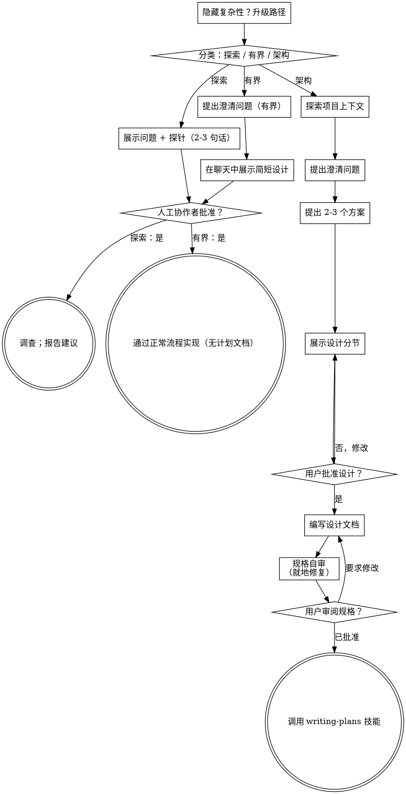

# 将想法头脑风暴成设计

通过自然的协作式对话，帮助把想法转化为完整成形的设计和规格说明。

先判断这项请求需要多少流程，然后沿着相应路径推进：理解上下文、完善想法、展示设计，并获得你的人工协作者的批准。

<HARD-GATE>
在你告诉你的人工协作者你打算做什么、且他们批准之前，不得调用任何实现技能、编写任何代码、搭建任何项目或采取任何实现行动。这适用于下面的每一条路径、每一项任务——仪式感会随任务规模调整，但批准门槛永远不会调整。
</HARD-GATE>

## 三条路径

在提出第一个问题之前，先判断请求属于哪一类，并明确说出判断——“这看起来范围明确，所以我会在这里展示一个简短设计，而不是编写规格说明”——这样你的人工协作者可以纠正你的判断：

- **Spike（探索）**——可行性问题（“我们能不能……”“是否可能……”“快速粗糙地做也可以”），其产物是答案，而不是要保留的代码。用 2-3 句话说明问题和你要尝试的内容，得到点头后，再以正确性允许的最低成本查明事实。不写设计文档，不写规格文件。把发现报告为建议；任何构建的内容都要标记为一次性试验品。
- **Bounded（有界）**——对本仓库中已有代码的范围明确的改动：新标志、小型端点、单文件修复。了解应用类型还不够——只有你要改变的流程已经存在并可供阅读时，才算有界。如果没有现成流程可改，这项任务就不是有界任务。提出关键的澄清问题，在聊天中展示简短设计（几句话到几段短文），然后停下来。只有你的人工协作者对该设计说“是”之后才能开始实现——有界任务的批准门槛与架构任务一样严格。不写规格文件，不写实现计划文档。
- **Architectural（架构）**——新项目、新子系统、重构组件协作方式的改动，或会改变其他人所依赖接口的改动。遵循完整流程：提问、方案、分节设计、书面规格，然后使用 writing-plans 技能。

在两条路径之间犹豫时，选择较重的一条。这个棘轮只能向一个方向移动：如果任务中途发现了隐藏复杂性，就升级路径——停下来说明情况，然后提升级别。任务中途不能降级。

## 反模式：“太简单，不需要批准”

每条路径都必须在实现前由你的人工协作者批准你的意图。待办列表、单函数工具、配置改动——设计可以只是在聊天中写两句话，但你仍然必须展示并获得批准。“简单”任务正是未经检查的假设最容易造成大量返工的地方。随简单程度变化的是产物，不是批准。

## 警示信号

| 想法 | 现实 |
|---------|---------|
| “这太简单了，不需要设计” | 简单意味着设计简短，而不是没有设计。在聊天中写两句话，然后获得批准。 |
| “我把它称为有界任务，就可以跳过规格” | 试图用标签来跳过工作本身就是疑点——选择较重的路径。 |
| “它是有界任务，而且设计很明显——我先开始做，他们可以边看边读” | 门槛是批准，而不是设计的长度。展示之后就停下，直到听到“是”。 |
| “我了解这种应用，所以它是有界任务” | 有界性衡量的是仓库，而不是你的熟悉程度。新项目没有现成流程——它属于架构任务。 |
| “探索成功了，所以我就保留代码” | 探索的产物是答案。保留代码是一个新请求——重新分类。 |
| “它变大了，但我快做完了——没必要重新分类” | 隐藏复杂性会在任务中途升级路径。停下来并说明。 |
| “他们批准了探索，所以后续改动也被批准了” | 每项任务都有自己的分类和自己的批准。 |

## 检查清单

先分类，宣布路径，然后为路径上的每一项创建任务并按顺序完成。

**Spike（探索）：**
1. **探索项目上下文**——收集足够的信息来界定探针
2. **展示问题 + 探针计划**——2-3 句话
3. **获得批准**——点头即可
4. **调查**——以正确性允许的最低成本进行
5. **报告发现**——给出建议；将任何构建的内容标记为一次性试验品

**Bounded（有界）：**
1. **探索项目上下文**——检查文件、文档、近期提交
2. **提出澄清问题**——一次一个，只问关键问题
3. **在聊天中展示简短设计**——方案、涉及的文件、测试
4. **获得批准**——停下等待明确的“是”；展示设计并在同一口气中开始实现，就是跳过门槛
5. **实现**——按照正常开发流程推进（适用 TDD）；不写计划文档

**Architectural（架构）：**
1. **探索项目上下文**——检查文件、文档、近期提交
2. **在恰当时机提供可视化伴侣**——不要一开始就提供。第一次遇到一个真正“展示比描述更清楚”的问题时，再提供它（单独发一条消息）；获准后，它的浏览器标签页会为你打开。若从未出现视觉问题，就永远不要提供。见下方“可视化伴侣”一节。
3. **提出澄清问题**——一次一个，理解目的、约束和成功标准
4. **提出 2-3 个方案**——说明权衡并给出你的推荐
5. **展示设计**——按复杂度分节，在每一节之后获得用户批准
6. **编写设计文档**——保存到 `docs/superpowers/specs/YYYY-MM-DD-<topic>-design.md` 并提交
7. **规格自审**——快速检查占位符、矛盾、歧义和范围（见下方）
8. **用户审阅书面规格**——请用户在继续之前审阅规格文件
9. **过渡到实现**——调用 writing-plans 技能来创建实现计划

## 流程图

**终止状态受路径约束。**架构路径：头脑风暴之后唯一可以调用的技能是 writing-plans——绝不能调用 frontend-design、mcp-builder 或其他实现技能。有界路径：批准后直接通过正常开发流程实现；不写计划文档。探索路径：终止状态是报告建议。

## 具体流程

以下子节服务于有界路径和架构路径（探索路径会在“展示探针、获得点头”处停止）。从**探索方案**开始的章节属于架构路径的深度流程——对于有界工作，上下文、几个问题和聊天中的简短设计就是完整流程。

**理解想法：**

- 先检查当前项目状态（文件、文档、近期提交）
- 在提出详细问题之前，评估范围：如果请求描述了多个相互独立的子系统（例如“构建一个包含聊天、文件存储、计费和分析的平台”），立即指出这一点。不要在一个需要先拆解的项目上花时间完善细节问题。
- 如果项目对于一份规格来说过大，帮助用户拆分为子项目：哪些部分彼此独立，它们如何关联，以及应该按什么顺序构建？然后按照正常设计流程对第一个子项目进行头脑风暴。每个子项目都有自己的规格 → 计划 → 实现周期。
- 对于范围合适的项目，一次提出一个问题，以完善想法
- 尽可能优先使用选择题，但开放式问题也可以
- 只在每条消息中提出一个问题——如果某个主题需要进一步探索，就拆成多个问题
- 聚焦于理解：目的、约束、成功标准

**探索方案：**

- 提出 2-3 个不同方案，并说明权衡
- 以对话方式展示选项，给出你的推荐和理由
- 先给出你的推荐并解释原因
- 严格遵循 YAGNI——从每个方案和设计中移除不必要的功能

**展示设计：**

- 一旦你认为已经理解要构建的内容，就展示设计
- 让每一节的篇幅与复杂度相匹配：直接的问题写几句话，细微的问题最多写 200-300 字
- 每节之后询问目前看起来是否正确
- 覆盖：架构、组件、数据流、错误处理、测试
- 如果有任何内容不清楚，准备退回去继续澄清

**为隔离和清晰而设计：**

- 将系统拆分为更小的单元，每个单元有一个明确用途，通过定义良好的接口通信，并且可以独立理解和测试
- 对每个单元，你都应该能回答：它做什么、如何使用、依赖什么？
- 不阅读内部实现，别人能理解一个单元做什么吗？你能在不破坏消费者的情况下更换内部实现吗？如果不能，边界还需要改进。
- 更小且边界明确的单元也更易于你处理——你对能够一次放入上下文的代码推理得更好，文件聚焦时编辑也更可靠。文件变大时，往往说明它承担了过多职责。

**在现有代码库中工作：**

- 在提出改动前探索当前结构。遵循现有模式。
- 如果现有代码的问题会影响这项工作（例如文件变得过大、边界不清、职责纠缠），将有针对性的改进纳入设计——这正是优秀开发者处理手头代码时会做的事。
- 不要提出无关的重构。保持聚焦，只做服务于当前目标的工作。

## 设计之后（架构路径）

**文档：**

- 将经过验证的设计（规格）写入 `docs/superpowers/specs/YYYY-MM-DD-<topic>-design.md`
  - （如果用户对规格位置有偏好，以用户偏好为准）
- 如果可用，使用 elements-of-style:writing-clearly-and-concisely 技能
- 将设计文档提交到 git

**规格自审：**
在写完规格文档后，用全新的视角查看它：

1. **占位符扫描：**是否有“TBD”“TODO”、未完成的章节或模糊需求？修复它们。
2. **内部一致性：**是否有章节互相矛盾？架构是否与功能描述一致？
3. **范围检查：**它是否足够聚焦，可以对应一个实现计划，还是需要拆解？
4. **歧义检查：**某项需求是否可能有两种解释？如果有，选择一种并明确写出。

就地修复所有问题。无需重新审阅——修好后继续。

**用户审阅门槛：**
规格审阅循环通过后，请用户在继续之前审阅书面规格：

> “规格已写入并提交到 `<path>`。请审阅它，并在我们开始编写实现计划之前告诉我是否要进行任何修改。”

等待用户回复。如果他们要求修改，完成修改并重新运行规格审阅循环。只有用户批准后才能继续。

**实现：**

- 调用 writing-plans 技能来创建详细的实现计划
- 不得调用任何其他技能。writing-plans 是下一步。

## 可视化伴侣

这是一个基于浏览器的伴侣，用于在头脑风暴期间展示模型、图表和视觉选项。它作为工具提供，而不是一种模式。接受使用伴侣意味着它可用于适合视觉呈现的问题；并不意味着每个问题都要通过浏览器完成。

**提供伴侣（恰逢其时）：**不要一开始就提供。等到问题确实是“展示比描述更清楚”的真实模型/布局/图表问题时再提供，并单独发送一条消息：
> “接下来这部分展示出来可能更容易理解——我可以在浏览器标签页中边走边制作模型、图表和对比。这项功能还比较新，可能消耗较多 token。要我提供吗？如果你同意，我会自动打开第一个界面。”

这条邀请**必须单独成消息**。只能发送邀请——不要附带澄清问题、摘要或其他内容。等待用户回复。如果他们接受，就用 `--open` 启动服务器，以便浏览器自动打开第一个界面。如果他们拒绝，就继续纯文本交流，除非他们再次提出，否则不要再次提供。

**按问题决定：**即使用户接受了伴侣，也要针对**每个问题**决定使用浏览器还是终端。判断标准是：用户看到它会比读到它理解得更好吗？

- **使用浏览器**处理本身具有视觉属性的内容——模型、线框图、布局比较、架构图、并排视觉设计
- **使用终端**处理文本内容——需求问题、概念选择、权衡列表、A/B/C/D 文本选项、范围决策

关于 UI 主题的问题不自动属于视觉问题。“在此上下文中，个性意味着什么？”是概念问题——使用终端。“哪个向导布局更好？”是视觉问题——使用浏览器。

如果他们同意使用伴侣，继续之前先阅读详细指南：
`skills/brainstorming/visual-companion.md`
