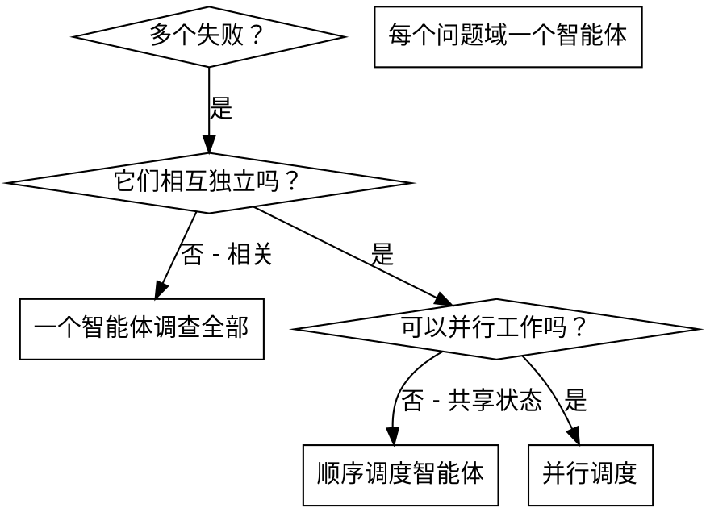

# 调度并行智能体

## 概述

你将任务委派给具有隔离上下文的专业智能体。通过精确编写它们的指令和上下文，确保它们保持聚焦并取得成功。它们不应继承你的会话上下文或历史记录——你要为它们构造恰好所需的内容。这也能保留你自己的上下文，用于协调工作。

当出现多个无关的失败（不同测试文件、不同子系统、不同 bug）时，按顺序调查会浪费时间。每项调查都是独立的，因此可以并行进行。

**核心原则：**每个独立的问题域调度一个智能体。让它们并发工作。

## 何时使用



**适用于：**
- 3 个或更多测试文件因不同根因失败
- 多个子系统彼此独立地损坏
- 每个问题都可以在不了解其他问题的情况下理解
- 调查之间没有共享状态

**不适用于：**
- 失败彼此相关（修复一个可能修复其他失败）
- 需要理解完整系统状态
- 共享状态（智能体会互相干扰）

## 模式

### 1. 识别独立域

按损坏的部分对失败进行分组：
- 文件 A 测试：工具批准流程
- 文件 B 测试：批量完成行为
- 文件 C 测试：中止功能

每个域都是独立的——修复工具批准不会影响中止测试。

### 2. 创建聚焦的智能体任务

每个智能体获得：
- **具体范围：**一个测试文件或子系统
- **明确目标：**让这些测试通过
- **约束：**不要修改其他代码
- **预期输出：**总结你发现并修复的内容

### 3. 并行调度

在同一条响应中发出全部三个子智能体调度——它们会并行运行：

```text
子智能体（通用）：“修复 agent-tool-abort.test.ts 的失败”
子智能体（通用）：“修复 batch-completion-behavior.test.ts 的失败”
子智能体（通用）：“修复 tool-approval-race-conditions.test.ts 的失败”
# 三者并发运行。
```

一条响应中的多个调度调用 = 并行执行。每条响应一个调度 = 顺序执行。

### 4. 审阅与集成

智能体返回后：
- 阅读每个摘要
- 验证修复之间不会冲突
- 运行完整测试套件
- 集成所有改动

## 智能体提示词结构

优秀的智能体提示词具备以下特点：
1. **聚焦**——一个明确的问题域
2. **自包含**——理解问题所需的全部上下文
3. **明确输出**——智能体应返回什么？

```markdown
修复 src/agents/agent-tool-abort.test.ts 中失败的 3 个测试：

1. “should abort tool with partial output capture”——期望消息中包含 'interrupted at'
2. “should handle mixed completed and aborted tools”——快速工具被中止，而不是完成
3. “should properly track pendingToolCount”——期望 3 个结果，但得到 0 个

这些是时序/竞态条件问题。你的任务：

1. 阅读测试文件，理解每个测试验证什么
2. 找出根因——是时序问题还是实际 bug？
3. 通过以下方式修复：
   - 用基于事件的等待替换任意超时
   - 如果发现中止实现有 bug，则修复它
   - 如果测试的是已经改变的行为，则调整测试期望

不要只增加超时——找出真正的问题。

返回：你发现的根因和所做改动的摘要。
```

## 常见错误

**❌ 过于宽泛：**“修复所有测试”——智能体会迷失
**✅ 具体：**“修复 agent-tool-abort.test.ts”——保持聚焦

**❌ 没有上下文：**“修复竞态条件”——智能体不知道问题在哪里
**✅ 有上下文：**粘贴错误消息和测试名称

**❌ 没有约束：**智能体可能重构一切
**✅ 有约束：**“不要修改生产代码”或“只修复测试”

**❌ 输出模糊：**“修复它”——你不知道改了什么
**✅ 输出具体：**“返回根因和改动的摘要”

## 何时不要使用

**相关失败：**修复一个可能会修复其他失败——先一起调查
**需要完整上下文：**理解问题需要查看整个系统
**探索式调试：**你还不知道哪里坏了
**共享状态：**智能体会互相干扰（编辑同一文件、使用相同资源）

## 会话中的真实示例

**场景：**一次重大重构后，3 个文件中有 6 个测试失败

**失败：**
- agent-tool-abort.test.ts：3 个失败（时序问题）
- batch-completion-behavior.test.ts：2 个失败（工具未执行）
- tool-approval-race-conditions.test.ts：1 个失败（执行次数 = 0）

**决策：**独立域——中止逻辑独立于批量完成，批量完成独立于竞态条件

**调度：**
```
智能体 1 → 修复 agent-tool-abort.test.ts
智能体 2 → 修复 batch-completion-behavior.test.ts
智能体 3 → 修复 tool-approval-race-conditions.test.ts
```

**结果：**
- 智能体 1：用基于事件的等待替换了超时
- 智能体 2：修复了事件结构 bug（threadId 位于错误位置）
- 智能体 3：增加了等待异步工具执行完成的逻辑

**集成：**所有修复彼此独立，没有冲突，完整套件通过

## 验证

智能体返回后：
1. **审阅每个摘要**——理解改动了什么
2. **检查冲突**——智能体是否编辑了相同代码？
3. **运行完整套件**——验证所有修复协同工作
4. **抽查**——智能体可能犯系统性错误
