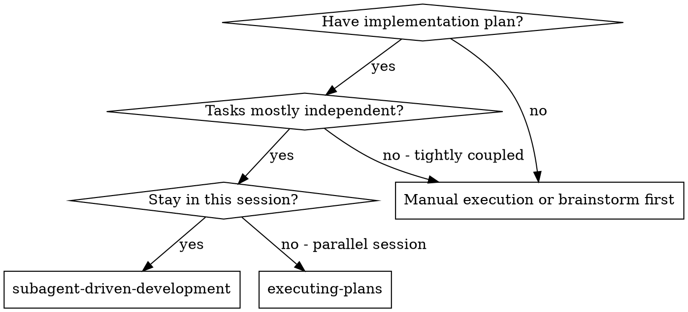
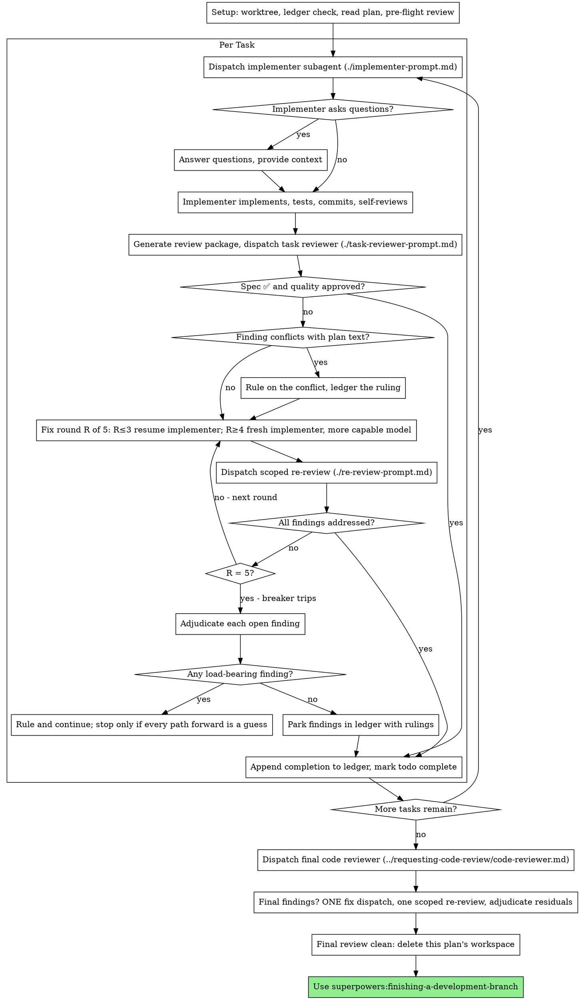

# 子代理驱动开发

通过为每个任务派遣一个全新的实现子代理来执行计划，在每个任务之后进行任务审查（规范符合性 + 代码质量），最后进行一次广泛的全分支审查。

**为什么使用子代理：** 你将任务委托给拥有隔离上下文的专门代理。通过精确编写指令和上下文，确保它们专注于任务并取得成功。它们绝不能继承你的会话上下文或历史——你要准确构造它们所需的内容。这也保留了你自己的上下文，用于协调工作。

**核心原则：** 每个任务使用全新的子代理 + 任务审查（规范 + 质量）+ 末尾的广泛审查 = 高质量、快速迭代

**旁白：** 工具调用之间最多叙述一行简短内容——账本和工具结果会保留记录。

**持续执行：** 不要在任务之间暂停并向你的用户伙伴确认。执行计划中的所有任务，不要停下。只有下面列出的四种原因，或所有任务完成，才可以停止。“要继续吗？”之类的提示和进度摘要会浪费他们的时间——他们要求你执行计划，那就执行。

**作出裁定，而不是停滞。** 正在运行的计划不会等待人类。冲突、歧义、计划缺陷、你本来会询问是否超出的上限——都要作出决定。规范是具有约束力的权威，计划是它的论证；当两者都没有回答时，由你的判断解决。将每个决定记录在账本中，格式为 `Ruling: <what you decided> — <why> — <what it costs if wrong>`，然后继续执行。错误的裁定会带来你的用户伙伴能够看到并撤销的返工；停在一个问题上会耗费他们一整天，却什么也得不到。

只有四件事会让你停止，也只有这四件事：不可逆或破坏性操作；安全敏感操作；工作区之外、按惯例需要先询问的副作用（合并、推送到共享分支、发布）；以及计划糟糕到每条前进路径都只能猜测。遇到这些情况，停止并询问。

## 何时使用



**与执行计划（并行会话）的区别：**
- 同一会话（没有上下文切换）
- 每个任务使用全新的子代理（没有上下文污染）
- 每个任务之后审查（规范符合性 + 代码质量），最后进行广泛审查
- 迭代更快（任务之间没有人类介入）

## 流程



## 设置

确保工作在隔离的工作区中进行：使用
superpowers:using-git-worktrees 创建一个，或验证现有工作区。
如果没有你的用户伙伴明确同意，绝不要在 main/master 分支上开始实现。

会话记忆不会在压缩后保留。在真实会话中，失去位置的控制器曾重新派遣整个已完成的任务序列——这是观察到的代价最高的失败。把进度记录在账本文件中，而不仅仅是 todos 中。

- 每个计划拥有一个工作区：技能开始时，运行此技能的
  `scripts/sdd-workspace PLAN_FILE`——它会打印计划的 git-ignored
  目录（`<repo-root>/.superpowers/sdd/<plan-basename>/`），这里存放
  本计划的所有产物：账本、简报、报告、审查包。
  绝不要读取或写入另一个计划的目录。
- 在 `<workspace>/progress.md` 检查本计划的账本。如果第一行命名了你的计划文件，且存在 `Task <N>: complete` 行，则任务已经完成——不要重新派遣；从第一个没有该行的任务继续。最后一行是修复轮次的任务处于循环中途：从下一轮继续。第一行命名了不同计划文件的账本——或旧的扁平路径 `.superpowers/sdd/progress.md` 下的散落账本——是另一个计划的进度：保留原处，创建你自己的新账本。
- 创建账本时将其身份写在第一行：
  `# SDD ledger — plan: <plan file path>`。
- 账本是你的恢复地图：它列出的提交即使在上下文不再记得你创建它们时，也存在于 git 中。压缩后，相信账本和 `git log`，不要相信自己的记忆。
- `git clean -fdx` 会销毁工作区（这是 git-ignored scratch）；如果发生这种情况，从 `git log` 恢复。

阅读一次计划，记下它的上下文和 Global Constraints，并为每个任务创建一个 todo。如果计划命名了 Spec，也阅读 Spec：规范是计划所依据的权威，计划中的冲突要根据 Spec 解决。没有可访问 Spec 的计划要在账本中记录这一点——没有 Spec 作依据的裁定是临时的。

在派遣任务 1 之前，扫描计划一次；扫描时写下你检查的冲突：

- 相互矛盾的任务，或与计划 Global Constraints 冲突的任务
- 计划明确要求、但审查标准视为缺陷的内容（例如不作任何断言的测试、逐字重复逻辑块）

扫描结果是一个表格，而不是结论。每一对共享文件或接口的任务各有一行：两个任务、一个任务针对另一个任务所消费的产物、以及你的发现。每个任务各有一行：它自身的文本是否自洽——它指定的测试与指定的代码是否一致、它创建的文件与之后接触的文件是否一致。“扫描干净”但没有这些行，不算运行过扫描。

将表格写入账本。在执行开始之前对发现的所有内容作出裁定——逐条依据强制要求它的计划文本——并在账本中记录每一项裁定。如果扫描干净，继续执行，不必评论。对它发现的每个冲突作出裁定——规范是具有约束力的权威，计划是它的论证——在对应行旁记录裁定，然后派遣任务 1。只在实现中才出现的冲突，交由审查循环兜底。

## 模型选择

使用能够处理每个角色的最弱模型，以节省成本并提高速度。

**机械实现任务**（隔离函数、清晰规范、1-2 个文件）：使用快速、便宜的模型。当计划写得明确时，大多数实现任务都是机械的。

**集成和判断任务**（多文件协调、模式匹配、调试）：使用标准模型。

**架构和设计任务：** 使用可用的最强模型。最终全分支审查属于此类——使用可用的最强模型派遣它，而不是会话默认模型。

**审查任务：** 根据 diff 的大小、复杂度和风险，选择具有相应判断力的模型。小型机械 diff 不需要最强模型；细微的并发变更则需要。小型修复 diff 的范围化重新审查使用便宜到中等层级即可。

**修复循环升级（第 4-5 轮）：** 使用至少比卡住的实现者高一档的模型。

**派遣子代理时始终明确指定模型。** 省略模型会继承你的会话模型——通常是最强且最昂贵的模型——从而悄悄违背这一节。

**轮数胜过 token 价格。** 子代理需要多少轮，以及它的上下文成本，取决于轮数；最便宜的模型在多步骤任务中通常需要 2-3 倍的轮数——总体成本更高。对于根据文字描述工作的审查者和实现者，中档模型是底线。当任务计划文本包含要写入的完整代码时，实现只是转录加测试：为实现者使用最便宜的层级。单文件机械修复也使用最便宜的层级。

**实现任务的复杂度信号：**
- 触及 1-2 个文件且有完整规范 → 便宜模型
- 触及多个文件且涉及集成 → 标准模型
- 需要设计判断或广泛理解代码库 → 最强模型

## 任务循环

**批量处理小型同形工作。** 当计划列出若干个小型、独立且形状相同的任务——同一行修复、常量变更或字段添加在多个文件中重复——不要为每个任务派遣一个子代理。编写一份派遣简报，列出所有文件及其变更，将整个批次发送给一个子代理，并将其 diff 作为一个整体审查。只有需要各自判断、各自测试或各自审查范围的工作，才保留每任务一次派遣。

你粘贴到派遣提示中的所有内容——以及子代理打印的所有内容——都会在会话的剩余时间留在上下文中，并在每个后续轮次被重新读取。通过文件交接产物。

**等待已派遣的子代理：** 不要用短超时时间轮询等待接口，也不要在无声、无限期的等待中停留。在本地仍有工作时——更新账本、打包下一次审查、阅读报告——继续工作；结果会自行到达。真正空闲时，使用有界的等待时段（平台允许时等待五到十分钟），期间发布一行状态并协调仍在运行的子代理：列出它们，追查任何完成但没有报告的子代理。有界时段能保留长等待的大部分效率，同时保证在几分钟内发现卡住或丢失的子代理，而不是等到会话末尾。

### 1. 派遣实现者

在派遣前记录 BASE（`git rev-parse HEAD`）——审查包和修复轮次 diff 需要它。

- **任务简报：** 在派遣实现者之前，运行此技能的 `scripts/task-brief PLAN_FILE N`——它会将任务的完整文本提取到一个唯一命名的文件，并打印路径。编写派遣内容时，让简报成为单一需求来源；简报开头写明“先阅读此文件——它是你的需求，其中有要逐字使用的准确值”。派遣应包含：(1) 此任务在项目中的位置一行说明；(2) 简报路径，并明确说“先阅读此文件——它是你的需求，其中有要逐字使用的准确值”；(3) 简报无法知道的接口和前序任务决定；(4) 你对简报中发现的任何歧义的解决；(5) 报告文件路径和报告契约。准确值（数字、魔法字符串、签名、测试用例）只出现在简报中。绝不要让子代理阅读整个计划文件。
- **报告文件：** 将实现者的报告文件按简报命名（简报 `…/task-N-brief.md` → 报告 `…/task-N-report.md`），并将其放入派遣提示。实现者将完整报告写入该文件，只返回状态、提交、一行测试摘要和疑虑。
- 派遣提示描述一个任务，而不是会话历史。不要把累积的前序任务摘要（“任务 1-3 之后的状态”）粘贴到后续派遣中——真实会话中的一次派遣达到 42k 字符，其中 99% 是粘贴的历史。全新的子代理需要它的任务、它接触的接口和全局约束。除此之外什么也不要给。
- 派遣内容携带不使用子代理的契约（它在实现者模板中）：实现者绝不派遣子代理——不派遣辅助者，也不派遣审查者。审查由你在报告之后进行。在真实会话中，每个工作者生成的审查者都重复了控制器已经派遣的任务审查——每个任务多出一个完整的审查席位。
- 如果前一个任务在当前任务涉及的区域留下了发现，将账本条目的指针带入派遣中。
- 记录派遣结果中的实现者代理身份——修复循环的第 1-3 轮要恢复此代理。
- 绝不要并行派遣多个实现子代理（会发生冲突）。

模板：[implementer-prompt.md](implementer-prompt.md)

### 2. 处理报告

实现子代理会报告四种状态之一。按以下方式处理：

**DONE：** 生成审查包（从本技能目录运行 `scripts/review-package PLAN_FILE BASE HEAD`，它会打印写入文件的唯一路径；BASE 是派遣实现者前记录的提交——绝不能使用 `HEAD~1`，它会悄悄丢掉多提交任务中除最后一个之外的所有提交），然后将任务审查者派遣出去，并传入打印出的路径。

**DONE_WITH_CONCERNS：** 实现者完成了工作，但提出了疑虑。继续之前阅读疑虑。如果疑虑与正确性或范围有关，在审查之前处理。如果只是观察（例如“这个文件越来越大”），记录下来并继续审查。

**NEEDS_CONTEXT：** 实现者需要没有提供的信息。提供缺失的上下文并重新派遣。

**BLOCKED：** 实现者无法完成任务。评估阻塞原因：
1. 如果是上下文问题，提供更多上下文并用相同模型重新派遣
2. 如果任务需要更多推理能力，用更强的模型重新派遣
3. 如果任务太大，拆成更小的部分
4. 如果计划本身有误，对修正作出裁定，将裁定记入账本，并携带该裁定重新派遣

**绝不要**忽略升级请求，或在不作任何改变的情况下强迫同一模型重试。如果实现者说自己卡住了，就说明需要改变某些东西。

如果实现者提出问题——无论是在开始之前还是任务中途——都要清楚、完整地回答，提供额外上下文（如有），不要催促它进入实现。

### 3. 审查任务

每任务审查是任务范围内的门禁。广泛审查只在最后的全分支审查中进行。绝不要跳过任务审查，也绝不接受缺少任一结论的报告——规范符合性和任务质量都必须得到确认。实现者的自审不能替代任务审查；两者都需要。

- 将 diff 作为文件交给审查者：运行此技能的 `scripts/review-package PLAN_FILE BASE HEAD`，并将它打印出的文件路径传给审查者（或者不使用 bash 时：对该范围运行 `git log --oneline`、`git diff --stat` 和 `git diff -U10`，重定向到一个唯一命名的文件）。输出不会进入你自己的上下文，审查者可以通过一次 Read 调用看到包含提交列表、统计摘要和带上下文完整 diff 的文件。使用派遣实现者前记录的 BASE——绝不能使用 `HEAD~1`，它会悄悄截断多提交任务。没有 diff 文件，绝不要派遣任务审查者。
- **审查者输入：** 任务审查者获得三个路径——同一个简报文件、报告文件和审查包——以及约束任务的全局约束。
- 交给审查者的全局约束块，是它的注意力镜头。逐字复制计划的 Global Constraints 部分或规范中的强制要求：准确值、准确格式以及组件之间所述的关系（“与 X 相同的布局”“匹配 Y”）。审查者的模板已经携带流程规则（YAGNI、测试卫生、审查方法）——约束块只用于本项目规范的具体要求。
- 不要加入“检查所有使用处”或“如有用则运行竞态测试”之类的开放式指令，除非有具体的、任务相关的原因。
- 不要要求审查者在同一代码上重新运行实现者已经运行过的测试——实现者的报告携带测试证据。
- 不要预先判断审查者的发现——绝不要指示审查者忽略或不要标记某个具体问题。如果你认为某个发现会是误报，让审查者提出它，然后在审查循环中裁决。如果你正在编写的提示中出现“不要标记”“不要将 X 视为缺陷”“最多 Minor”或“计划选择了”——停止：这是预先判断，通常是为了省掉自己的审查循环。

任务审查者可能报告“⚠️ 无法从 diff 验证”的项目——要求存在于未更改代码中或跨越多个任务。这些项目不会阻塞审查其余部分，但你必须自己解决每一个，然后才能标记任务完成：你掌握计划和跨任务上下文，而审查者没有。如果确认某项确实存在缺口，将其视为规范审查失败——与其他发现一起进入修复循环。

模板：[task-reviewer-prompt.md](task-reviewer-prompt.md)

### 4. 修复循环

当审查报告规范 ❌、任何 Critical 或 Important 发现，或你确认某个 ⚠️ 项目是真实缺口时，循环就会触发。

循环开始前，有两条路径会立即离开循环：

- 边做边将 Minor 发现记录到进度账本中（`Task <N>: minor (deferred): <one-liner>`），并让最终全分支审查看到这个列表，以便分诊哪些必须在合并前修复。无人阅读的汇总等同于静默丢弃。Minor 发现永远不进入循环。
- 被计划强制要求的发现——或任何与计划文本要求冲突的发现——由你裁定：权衡发现与计划文本，以规范为具有约束力的权威，记录裁定后再行动。不要因为计划要求而驳回发现，也不要在没有记录裁定的情况下派遣违反计划的修复。

其余所有内容进入循环。一轮修复由一次修复派遣和一次范围化重新审查组成。每个任务最多五轮：

**第 1-3 轮——恢复原实现者。** 将未解决的发现逐字发给它。它的上下文仍然完整：它了解任务、代码和自己的选择。如果你的运行环境无法向仍在运行的子代理发送另一条消息，则派遣一个携带简报路径、报告文件路径和发现的全新实现者——无论哪种方式，报告文件都是持久记忆。

**第 4-5 轮——使用更强模型派遣新的实现者**（遵循模型选择），并提供简报路径、报告文件路径、未解决的发现以及以下说明：“之前的实现者已经尝试了这个任务 [N] 次；现在由你负责。阅读报告文件，了解已经尝试过的内容。”连续三次恢复后循环仍未解决，通常意味着实现者看不到自己的问题——新视角和能力升级应在同一步完成。

**每一轮，无论哪种方式：** 实现者修复问题，重新运行覆盖修改代码的测试，将修复报告追加到同一个报告文件，并返回简短契约。重新派遣审查者之前，确认修复报告包含覆盖测试、运行的命令和输出；三者齐全后再派遣重新审查。修复消息中写明覆盖测试文件名——单行修复不需要整个测试套件。

**重新审查是有范围的。** 运行 `scripts/review-package PLAN_FILE FIX_BASE HEAD`，其中 FIX_BASE 是上一次审查看到的 head，然后使用发现列表、简报、报告文件和打印出的 diff 路径，派遣 [re-review-prompt.md](re-review-prompt.md)。重新审查者要逐条裁定每个发现是 ADDRESSED 还是 NOT ADDRESSED，并只在修复 diff 中标记新破坏。修复 diff 中新的 Critical/Important 破坏加入未解决发现列表。未涉及范围的观察记录到账本，作为延后的 Minor——绝不延长循环。

**每轮之后，**将以下内容追加到账本：
`Task <N>: fix round <R>/5 (<X> addressed, <Y> open — <finding one-liners>; commits <a7>..<b7>)`

绝不要在控制器会话中自己修复发现——你的上下文要保持干净以便协调，控制器修复会跳过审查。

**断路器。** 当第 5 轮重新审查后仍有未解决发现时，停止派遣。自行裁定每个未解决发现——你掌握计划和跨任务上下文，而审查者没有：

- **审查者错了，或该观点有争议：** 搁置它——`Task <N>: parked — <finding> — Ruling: <why the code stands>`。最终审查会看到双方的观点。
- **确实存在，但没有下游内容依赖它：** 以相同方式搁置，并在裁定中说明它确实存在且延后处理。
- **确实存在且承重**——后续任务建立在它之上，或它揭示计划缺陷：对能解除依赖工作阻塞的最小变更作出裁定，将其记录为 `Task <N>: Ruling: <finding> — <what you decided and why>`，并带入下一任务的派遣中。搁置结构性失败会让所有依赖任务建立在它之上。只有当缺陷使每条前进路径都只能猜测时才停止。

只能在达到上限时裁定。在此之前裁定以结束循环，是换了名字的预先判断。每个裁定都必须成为账本条目——禁止静默丢弃。

### 5. 完成任务

当审查返回干净——或在达到上限时所有未解决发现都已带裁定搁置——在同一条消息中追加完成行和其他记录：

- `Task <N>: complete (commits <base7>..<head7>, review clean)`
- 触发断路器后：`Task <N>: complete (commits <base7>..<head7>, <K> parked)`

然后将 todo 标记为完成并继续。审查仍有未解决的 Critical/Important 问题，且没有在达到上限时修复或带裁定搁置时，绝不要进入下一个任务。

## 最终审查

最终全分支审查也要获得一个包：运行 `scripts/review-package PLAN_FILE MERGE_BASE HEAD`（MERGE_BASE 是分支开始时的提交，例如 `git merge-base main HEAD`），并将打印出的路径放入最终审查派遣中，让最终审查者读取一个文件，而不是用 git 重新推导分支 diff。使用可用的最强模型派遣（见模型选择），使用 superpowers:requesting-code-review 的 [code-reviewer.md](../requesting-code-review/code-reviewer.md)，并指向账本中延后的 Minor 和已搁置行，以便分诊哪些必须在合并前修复。

如果最终全分支审查返回发现，派遣一个修复子代理，携带完整的发现列表——不要为每个发现派遣一个修复者。每个发现一个修复者都会重建上下文并重新运行套件；一次真实会话中的最终审查修复波次成本超过所有任务之和。然后对修复波次严格运行一次范围化重新审查（对修复范围运行 `scripts/review-package PLAN_FILE FIX_BASE HEAD`，使用 [re-review-prompt.md](re-review-prompt.md)）。

按任务循环断路器中的方式裁定任何剩余发现：带裁定搁置，或对承重发现作出裁定并记录决定。这里没有第二个修复波次——当 finishing-a-development-branch 呈现选项时，剩余的承重发现会暴露给你的用户伙伴。

## 收尾

在删除任何内容之前，收集所有包含 `Ruling:` 的账本行——预检裁定、搁置发现、断路器裁定，全部都要——按作出顺序放到最终消息的“我作出的裁定”下，每一项都写明如果错误会付出什么代价。列表必须完整：如果账本中有一项裁定，列表中就必须有它。这个列表是你替用户伙伴作出的决定抵达他们的唯一位置——他们会阅读它，并返工任何你做错的内容。让裁定随工作区消失，就是秘密作出的决定。

当最终全分支审查干净且其修复已合并，删除此计划的工作区（`rm -rf <workspace>`）——git 历史现在就是记录。

使用 superpowers:finishing-a-development-branch。

## 常见合理化借口

| 借口 | 现实 |
|--------|---------|
| "Close enough on spec compliance" | 审查者发现规范缺口 = 没完成。修复，或达到上限后裁定——这才是仅有的两个出口。 |
| "I'll fix it myself, dispatching is overhead" | 控制器修复会污染你的上下文并跳过审查。恢复实现者。 |
| "One more round will converge" | 超过上限后轮次不会收敛——失败是结构性的。裁定并路由。 |
| "The reviewer will just find something new anyway" | 范围化重新审查用于验证修复；它不能漫游。未改代码中的新发现进入账本，而不是循环。 |
| "This finding is obviously wrong, I'll drop it" | 只能在达到上限时裁定，每项裁定都必须成为账本条目。禁止静默丢弃。 |
| "The fix was small, skip the re-review" | 未审查的修复会让回归进入代码库。每轮都以范围化重新审查结束。 |
| "Reviews slow the loop down" | 没有审查的循环只是未经验证的反复。审查是循环的刹车和方向盘。 |
| "Ledger bookkeeping is overhead" | 账本是压缩后仍能保留的东西。没有账本的控制器会重新派遣整个已完成的任务序列。 |
| "The implementer spawned its own reviewer — free extra assurance" | 这是重复审查同一个 diff 的席位；任务审查才是门禁。工作者生成的审查者是要标记的缺陷，而不是严谨性。 |

## 示例工作流

```
You: I'm using Subagent-Driven Development to execute this plan.

[Setup: worktree verified]
[Read plan file once: docs/superpowers/plans/feature-plan.md]
[Resolve workspace: scripts/sdd-workspace docs/superpowers/plans/feature-plan.md — no ledger inside, fresh start]
[Create todos for all tasks]

Task 1: Hook installation script

[Run task-brief for Task 1; dispatch implementer with brief + report paths + context]

Implementer: "Before I begin - should the hook be installed at user or system level?"

You: "User level (~/.config/superpowers/hooks/)"

Implementer: [Later]
  - Implemented install-hook command
  - Added tests, 5/5 passing
  - Self-review: Found I missed --force flag, added it
  - Committed

[Run review-package PLAN_FILE BASE HEAD; dispatch task reviewer with the printed path]
Task reviewer: Spec ✅ - all requirements met, nothing extra.
  Strengths: Good test coverage, clean. Issues: None. Task quality: Approved.

[Ledger: Task 1: complete (commits a1b2c3d..d4e5f6a, review clean)]

Task 2: Recovery modes

[Run task-brief for Task 2; dispatch implementer with brief + report paths + context]

Implementer: [No questions]
  - Added verify/repair modes
  - 8/8 tests passing
  - Committed

[Run review-package PLAN_FILE BASE HEAD; dispatch task reviewer with the printed path]
Task reviewer: Spec ❌:
  - Missing: Progress reporting (spec says "report every 100 items")
  Issues (Important): Magic number (100)

[Fix round 1: resume the implementer with both findings]
Implementer: Added progress reporting, extracted PROGRESS_INTERVAL constant.
  Re-ran test/recovery.test.js — 10/10 passing. Fix report appended.

[Run review-package PLAN_FILE FIX_BASE HEAD; dispatch scoped re-review]
Re-reviewer: Missing progress reporting — ADDRESSED (src/recovery.js:41).
  Magic number — ADDRESSED (src/recovery.js:7). New breakage: none.
  Verdict: all findings addressed.

[Ledger: Task 2: fix round 1/5 (2 addressed, 0 open; commits d4e5f6a..b7c8d9e)]
[Ledger: Task 2: complete (commits d4e5f6a..b7c8d9e, review clean)]

...

[After all tasks]
[Run review-package PLAN_FILE MERGE_BASE HEAD; dispatch final code-reviewer, most capable model]
Final reviewer: All requirements met. Deferred minors triaged: none block merge.

[Delete this plan's workspace — the record now lives in git]

Done! Using superpowers:finishing-a-development-branch.
```
