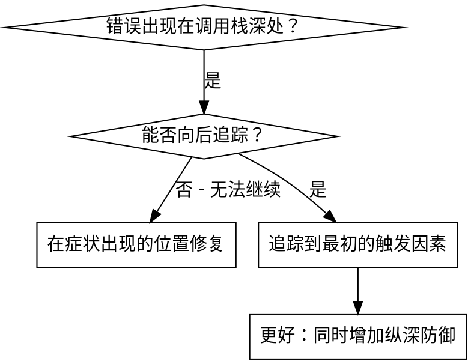
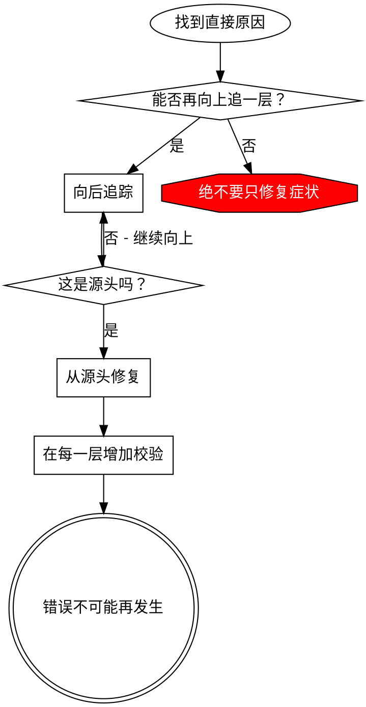

# 根因追踪

## 概述

错误经常在调用栈深处显现（在错误的目录中执行 git init、在错误的位置创建文件、使用错误的路径打开数据库）。你的本能可能是修复错误出现的位置，但那是在处理症状。

**核心原则：**沿着调用链向后追踪，直到找到最初的触发因素，然后从源头修复。

## 何时使用



**在以下情况使用：**
- 错误发生在执行过程的深处（而不是入口点）
- 堆栈跟踪显示出很长的调用链
- 不清楚无效数据最初来自哪里
- 需要找出是哪一个测试/代码触发了问题

## 追踪过程

### 1. 观察症状
```
Error: git init failed in ~/project/packages/core
```

### 2. 找到直接原因
**哪些代码直接导致了这个问题？**
```typescript
await execFileAsync('git', ['init'], { cwd: projectDir });
```

### 3. 追问：是谁调用了它？
```typescript
WorktreeManager.createSessionWorktree(projectDir, sessionId)
  → called by Session.initializeWorkspace()
  → called by Session.create()
  → called by test at Project.create()
```

### 4. 继续向上追踪
**传入的值是什么？**
- `projectDir = ''`（空字符串！）
- 空字符串作为 `cwd` 时会解析为 `process.cwd()`
- 这就是源代码目录！

### 5. 找到最初的触发因素
**空字符串从哪里来？**
```typescript
const context = setupCoreTest(); // Returns { tempDir: '' }
Project.create('name', context.tempDir); // Accessed before beforeEach!
```

## 添加堆栈跟踪

无法手动追踪时，可以增加插桩：

```typescript
// Before the problematic operation
async function gitInit(directory: string) {
  const stack = new Error().stack;
  console.error('DEBUG git init:', {
    directory,
    cwd: process.cwd(),
    nodeEnv: process.env.NODE_ENV,
    stack,
  });

  await execFileAsync('git', ['init'], { cwd: directory });
}
```

**关键：**在测试中使用 `console.error()`（不要使用 logger——它可能不会显示）

**运行并捕获：**
```bash
npm test 2>&1 | grep 'DEBUG git init'
```

**分析堆栈跟踪：**
- 查找测试文件名
- 找到触发调用的行号
- 识别模式（同一个测试？同一个参数？）

## 找出造成污染的测试

如果某些东西出现在测试期间，但你不知道是哪一个测试导致的：

使用本目录中的二分脚本 `find-polluter.sh`：

```bash
./find-polluter.sh '.git' 'src/**/*.test.ts'
```

它会逐个运行测试，在第一个造成污染的测试处停止。使用方法见脚本本身。

## 真实示例：空的 projectDir

**症状：**`.git` 被创建在 `packages/core/`（源代码目录）中

**追踪链：**
1. `git init` 在 `process.cwd()` 中运行 ← cwd 参数为空
2. WorktreeManager 使用空的 projectDir 被调用
3. Session.create() 被传入空字符串
4. 测试在 beforeEach 之前访问了 `context.tempDir`
5. setupCoreTest() 初始返回 `{ tempDir: '' }`

**根因：**顶层变量初始化时访问了空值

**修复：**将 tempDir 改为 getter，在 beforeEach 之前访问时抛出错误

**同时增加纵深防御：**
- 第 1 层：Project.create() 校验目录
- 第 2 层：WorkspaceManager 校验目录不为空
- 第 3 层：NODE_ENV 防护机制拒绝在 tmpdir 之外执行 git init
- 第 4 层：在 git init 之前记录堆栈跟踪

## 核心原则



**绝不要只修复错误出现的位置。**向后追踪，找到最初的触发因素。

## 堆栈跟踪提示

**在测试中：**使用 `console.error()` 而不是 logger——logger 可能被抑制
**操作之前：**在危险操作之前记录日志，而不是失败之后
**包含上下文：**目录、cwd、环境变量、时间戳
**捕获堆栈：**`new Error().stack` 会显示完整的调用链

## 实际影响

来自一次调试会话（2025-10-03）：
- 通过 5 层追踪找到了根因
- 在源头修复（getter 校验）
- 增加了 4 层防御
- 1847 个测试通过，没有污染
