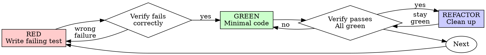

# 测试驱动开发（TDD）

## 概述

先写测试。观察它失败。编写最小代码使其通过。

**核心原则：** 如果你没有观察过测试失败，就不知道它是否测试了正确的内容。

**违反规则的字面要求，就是违反规则的精神。**

## 何时使用

**始终使用：**
- 新功能
- Bug 修复
- 重构
- 行为变更

**例外情况（询问你的用户伙伴）：**
- 一次性原型
- 生成的代码
- 配置文件

在想“这一次就跳过 TDD”吗？停下来。这是合理化借口。

## 铁律

```
NO PRODUCTION CODE WITHOUT A FAILING TEST FIRST
```

在测试之前写了代码？删除它。重新开始。

**没有例外：**
- 不要把它留作“参考”
- 不要在编写测试时“调整”它
- 不要看它
- 删除就是删除

从测试开始重新实现。就这样。

## Red-Green-Refactor



### RED - 编写失败测试

编写一个展示应有行为的最小测试。

<Good>
```typescript
test('retries failed operations 3 times', async () => {
  let attempts = 0;
  const operation = () => {
    attempts++;
    if (attempts < 3) throw new Error('fail');
    return 'success';
  };

  const result = await retryOperation(operation);

  expect(result).toBe('success');
  expect(attempts).toBe(3);
});
```
名称清晰，测试真实行为，只测试一件事
</Good>

<Bad>
```typescript
test('retry works', async () => {
  const mock = jest.fn()
    .mockRejectedValueOnce(new Error())
    .mockRejectedValueOnce(new Error())
    .mockResolvedValueOnce('success');
  await retryOperation(mock);
  expect(mock).toHaveBeenCalledTimes(3);
});
```
名称含糊，测试的是 mock 而不是代码
</Bad>

**要求：**
- 一个行为
- 名称清晰
- 真实代码（除非无法避免，否则不要使用 mock）

### Verify RED - 观察它失败

**强制要求。绝不要跳过。**

```bash
npm test path/to/test.test.ts
```

确认：
- 测试失败（不是报错）
- 失败消息符合预期
- 失败是因为功能缺失（不是拼写错误）

**测试通过了？** 你测试的是已有行为。修复测试。

**测试报错了？** 修复错误，重新运行，直到它正确失败。

### GREEN - 最小代码

编写能让测试通过的最简单代码。

<Good>
```typescript
async function retryOperation<T>(fn: () => Promise<T>): Promise<T> {
  for (let i = 0; i < 3; i++) {
    try {
      return await fn();
    } catch (e) {
      if (i === 2) throw e;
    }
  }
  throw new Error('unreachable');
}
```
刚好足以通过
</Good>

<Bad>
```typescript
async function retryOperation<T>(
  fn: () => Promise<T>,
  options?: {
    maxRetries?: number;
    backoff?: 'linear' | 'exponential';
    onRetry?: (attempt: number) => void;
  }
): Promise<T> {
  // YAGNI
}
```
过度工程化
</Bad>

不要添加功能、重构其他代码，或超出测试范围进行“改进”。

### Verify GREEN - 观察它通过

**强制要求。**

```bash
npm test path/to/test.test.ts
```

确认：
- 测试通过
- 其他测试仍然通过
- 输出干净（没有错误或警告）

**测试失败了？** 修复代码，而不是测试。

**其他测试失败了？** 立即修复。

### REFACTOR - 清理

仅在通过之后：
- 删除重复
- 改进名称
- 提取辅助函数

保持测试通过。不要添加行为。

### 重复

为下一个功能编写下一个失败测试。

## 好的测试

| 质量 | 好 | 差 |
|---------|------|-----|
| **最小化** | 一件事。名称中有“和”？拆分它。 | `test('validates email and domain and whitespace')` |
| **清晰** | 名称描述行为 | `test('test1')` |
| **表达意图** | 展示期望的 API | 掩盖代码应该做什么 |

编写或修改任何测试时，阅读 [writing-good-tests.md](writing-good-tests.md)，了解保持测试诚实的规则：
- 在写测试之前，明确会使测试失败的生产代码变更
- 断言真实行为，绝不要断言 mock 行为
- 将仅供测试使用的代码放在测试工具中，而不是生产类中
- 在 mock 依赖之前，理解依赖的副作用

## 常见合理化借口

| 借口 | 现实 |
|---------|---------|
| "Too simple to test" | 简单代码也会出错。测试只需 30 秒。 |
| "I'll test after" | 测试后编写的测试会立即通过——这证明不了任何事。它们可能测试了错误的内容，测试的是实现而不是行为，或者漏掉了你忘记的边界情况。你从未观察过它失败，因此从未证明它能捕获 bug。测试优先会强制产生这个失败。 |
| "Tests after achieve same goals (spirit not ritual)" | 测试后回答“这是什么行为？”；测试优先回答“应该是什么行为？”测试后编写的测试会受到你已经写出的代码影响——你验证的是记得的情况，而不是会发现的情况。没有证明测试有效的覆盖率。 |
| "Already manually tested" | 手动测试是临时性的：没有你覆盖了什么的记录，代码变更后无法重新运行，在压力下容易忘记情况。“我试过时能工作”≠全面。自动化测试每次都以相同方式运行。 |
| "Deleting X hours is wasteful" | 沉没成本谬误——无论如何那些时间都已经花费了。真正的选择是：用 TDD 重写（高信心）还是保留代码并在之后补测试（低信心，容易产生 bug）。保留你无法信任的代码才是浪费。 |
| "Keep as reference, write tests first" | 你会调整它。这就是测试后编写。删除就是删除。 |
| "Need to explore first" | 可以。丢弃探索结果，从 TDD 开始。 |
| "Test hard = design unclear" | 听取测试的意见。难以测试 = 难以使用。 |
| "TDD will slow me down" | TDD 才是务实路径：在提交前捕获 bug，防止回归，让你可以无惧地重构。“务实”的捷径意味着在生产环境调试——更慢，而不是更快。 |
| "Manual test faster" | 手动测试不能证明边界情况。每次变更你都要重新测试。 |
| "Existing code has no tests" | 你正在改进它。为现有代码添加测试。 |

## 红旗信号——停止并重新开始

- 测试之前写了代码
- 实现之后写测试
- 测试立即通过
- 无法解释测试为何失败
- 测试“之后”再添加
- 合理化“就这一次”
- “我已经手动测试过了”
- “测试后也能达到同样目的”
- “重在精神，不是仪式”
- “留作参考”或“调整现有代码”
- “已经花了 X 小时，删除太浪费”
- “TDD 很教条，我是在务实”
- “这次不一样，因为……”

**所有这些都意味着：删除代码。用 TDD 重新开始。**

## 示例：Bug 修复

**Bug：** 接受空 email

**RED**
```typescript
test('rejects empty email', async () => {
  const result = await submitForm({ email: '' });
  expect(result.error).toBe('Email required');
});
```

**Verify RED**
```bash
$ npm test
FAIL: expected 'Email required', got undefined
```

**GREEN**
```typescript
function submitForm(data: FormData) {
  if (!data.email?.trim()) {
    return { error: 'Email required' };
  }
  // ...
}
```

**Verify GREEN**
```bash
$ npm test
PASS
```

**REFACTOR**
如果需要，为多个字段提取验证逻辑。

## 验证清单

在将工作标记为完成之前：

- [ ] 每个新函数/方法都有测试
- [ ] 在实现之前观察每个测试失败
- [ ] 每个测试都因预期原因失败（功能缺失，而不是拼写错误）
- [ ] 编写了能通过每个测试的最小代码
- [ ] 所有测试通过
- [ ] 输出干净（没有错误或警告）
- [ ] 测试使用真实代码（仅在无法避免时使用 mock）
- [ ] 已覆盖边界情况和错误

无法勾选所有项？你跳过了 TDD。重新开始。

## 卡住时

| 问题 | 解决方案 |
|---------|----------|
| 不知道如何测试 | 写出期望的 API。先写断言。询问你的用户伙伴。 |
| 测试太复杂 | 设计太复杂。简化接口。 |
| 必须 mock 所有内容 | 代码耦合太紧。使用依赖注入。 |
| 测试设置很庞大 | 提取辅助函数。仍然复杂？简化设计。 |

## 调试集成

发现 bug？编写复现它的失败测试。遵循 TDD 循环。测试既证明修复，也防止回归。

绝不要不写测试就修复 bug。

## 最终规则

```
Production code → test exists and failed first
Otherwise → not TDD
```

没有你的用户伙伴许可，不得有任何例外。
