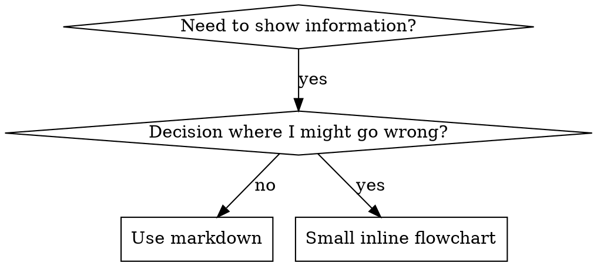

# 编写技能

## 概述

**编写技能就是将测试驱动开发应用于流程文档。**

**个人技能存放在运行时的技能目录中**（Claude Code 使用 `~/.claude/skills/`）——有关这些运行时中的路径，请参阅 [codex-tools.md](../using-superpowers/references/codex-tools.md) 或 [gemini-tools.md](../using-superpowers/references/gemini-tools.md)。Codex、Copilot CLI 和 Gemini CLI 也都将 `~/.agents/skills/` 识别为跨运行时别名。

你编写测试用例（带压力场景的子代理），观察它们失败（基线行为），编写技能（文档），观察测试通过（代理遵守），然后重构（堵住漏洞）。

**核心原则：**如果你没有观察过代理在没有该技能时失败，就不知道这个技能是否教会了它正确的行为。

**必需背景：**使用此技能前必须理解 superpowers:test-driven-development。该技能定义了基础的 RED-GREEN-REFACTOR 循环。本技能将 TDD 适配到文档上。

**官方指南：**Anthropic 的官方技能编写最佳实践请参阅 anthropic-best-practices.md。本文档提供额外的模式，用于补充该 TDD 导向的指南。

## 什么是技能？

**技能**是关于经过验证的技术、模式或工具的参考指南。技能帮助未来的代理找到并应用有效的方法。

**技能是：**可复用的技术、模式、工具、参考指南

**技能不是：**描述你曾经如何解决某个问题的叙事

## 技能的 TDD 映射

| TDD 概念 | 技能创建 |
|-------------|----------------|
| **测试用例** | 带压力场景的子代理 |
| **生产代码** | 技能文档 |
| **测试失败（RED）** | 代理在没有技能时违反规则 |
| **测试通过（GREEN）** | 有技能时代理遵守规则 |
| **重构** | 在保持遵守的同时堵住漏洞 |
| **先写测试** | 在写技能之前运行基线场景 |
| **观察它失败** | 逐字记录代理使用的借口 |
| **最少代码** | 编写技能来解决这些具体的违规行为 |
| **观察它通过** | 验证代理现在遵守规则 |
| **重构循环** | 找到新的借口 → 堵住漏洞 → 重新验证 |

整个技能创建流程遵循 RED-GREEN-REFACTOR。

## 何时创建技能

**在以下情况下创建：**
- 这项技术对你来说并非直觉上显而易见
- 你会在多个项目中再次参考它
- 该模式具有广泛适用性（不是项目特定的）
- 其他人也会受益

**不要在以下情况下创建：**
- 一次性解决方案
- 其他地方已经充分记录的标准实践
- 项目特定的约定（放入你的说明文件）
- 机械化约束（如果可以用正则表达式/验证来强制执行，就自动化它——把文档留给需要判断的事项）

## 技能类型

### 技术
包含步骤的具体方法（condition-based-waiting、root-cause-tracing）

### 模式
一种思考问题的方式（flatten-with-flags、test-invariants）

### 参考
API 文档、语法指南、工具文档（office docs）

## 目录结构


```
skills/
  skill-name/
    SKILL.md              # Main reference (required)
    supporting-file.*     # Only if needed
```

**扁平命名空间**——所有技能都位于一个可搜索的命名空间中

**单独文件适用于：**
1. **大型参考资料**（100 行以上）——API 文档、全面的语法指南
2. **可复用工具**——脚本、工具、模板

**保持内联：**
- 原则和概念
- 代码模式（少于 50 行）
- 其他所有内容

## SKILL.md 结构

**Frontmatter（YAML）：**
- 两个必需字段：`name` 和 `description`（所有受支持字段请参见 [agentskills.io/specification](https://agentskills.io/specification)）
- 总长度最多 1024 个字符
- `name`：仅使用字母、数字和连字符（不能有括号或特殊字符）
- `description`：使用第三人称，只描述何时使用（不是它做什么）
  - 以“Use when...”开头，聚焦触发条件
  - 包含具体症状、情况和上下文
  - **绝不概述技能的流程或工作流**（原因见 SDO 部分）
  - 尽可能控制在 500 个字符以内

```markdown
---
name: Skill-Name-With-Hyphens
description: Use when [specific triggering conditions and symptoms]
---

# Skill Name

## Overview
What is this? Core principle in 1-2 sentences.

## When to Use
[Small inline flowchart IF decision non-obvious]

Bullet list with SYMPTOMS and use cases
When NOT to use

## Core Pattern (for techniques/patterns)
Before/after code comparison

## Quick Reference
Table or bullets for scanning common operations

## Implementation
Inline code for simple patterns
Link to file for heavy reference or reusable tools

## Common Mistakes
What goes wrong + fixes

## Real-World Impact (optional)
Concrete results
```


## 技能发现优化（SDO）

**对发现至关重要：**未来的代理需要找到你的技能

### 1. 丰富的 Description 字段

**目的：**代理读取 description 来决定现在是否加载技能。它必须回答：“我现在应该读取这个技能吗？”

**格式：**以“Use when...”开头，聚焦触发条件

**关键点：description = 何时使用，不是技能做什么**

description 应当**只**描述触发条件。不要在 description 中概述流程或工作流。

**为什么重要：**测试发现，当 description 概述技能工作流时，代理可能会按照 description 行动，而不读取完整的技能内容。一个写成“任务之间进行代码审查”的 description，导致代理只做一次审查，即使流程图明确显示了两次审查（规范符合性，然后代码质量）。

将 description 改为只写“在当前会话中执行包含独立任务的实现计划”后，代理正确读取了流程图，并遵循两阶段审查流程。

**陷阱：**概述工作流的 description 会制造代理可以走的捷径。代理会跳过技能正文，而直接遵循 description。

```yaml
# ❌ BAD: Summarizes workflow - agents may follow this instead of reading skill
description: Use when executing plans - dispatches subagent per task with code review between tasks

# ❌ BAD: Too much process detail
description: Use for TDD - write test first, watch it fail, write minimal code, refactor

# ✅ GOOD: Just triggering conditions, no workflow summary
description: Use when executing implementation plans with independent tasks in the current session

# ✅ GOOD: Triggering conditions only
description: Use when implementing any feature or bugfix, before writing implementation code
```

**内容：**
- 使用具体的触发条件、症状和情况，表示该技能适用
- 描述*问题*（竞态条件、行为不一致），而不是*特定语言的症状*（setTimeout、sleep）
- 除非技能本身具有技术特定性，否则保持技术无关
- 如果技能具有技术特定性，要在触发条件中明确说明
- 使用第三人称（会被注入系统提示词）
- **绝不概述技能的流程或工作流**

```yaml
# ❌ BAD: Too abstract, vague, doesn't include when to use
description: For async testing

# ❌ BAD: First person
description: I can help you with async tests when they're flaky

# ❌ BAD: Mentions technology but skill isn't specific to it
description: Use when tests use setTimeout/sleep and are flaky

# ✅ GOOD: Starts with "Use when", describes problem, no workflow
description: Use when tests have race conditions, timing dependencies, or pass/fail inconsistently

# ✅ GOOD: Technology-specific skill with explicit trigger
description: Use when using React Router and handling authentication redirects
```

### 2. 关键词覆盖

使用代理会搜索的词：
- 错误消息：“Hook timed out”“ENOTEMPTY”“race condition”
- 症状：“flaky”“hanging”“zombie”“pollution”
- 同义词：“timeout/hang/freeze”“cleanup/teardown/afterEach”
- 工具：实际命令、库名、文件类型

### 3. 描述性命名

**使用主动语态，以动词开头：**
- ✅ `creating-skills`，而不是 `skill-creation`
- ✅ `condition-based-waiting`，而不是 `async-test-helpers`

### 4. 令牌效率（关键）

**问题：**入门流程和频繁引用的技能会加载到**每一个**会话中。每个令牌都很重要。

**目标字数：**
- 入门工作流：每个少于 150 个词
- 频繁加载的技能：总计少于 200 个词
- 其他技能：少于 500 个词（仍需简洁）

**技巧：**

**把细节移到工具帮助中：**
```bash
# ❌ BAD: Document all flags in SKILL.md
search-conversations supports --text, --both, --after DATE, --before DATE, --limit N

# ✅ GOOD: Reference --help
search-conversations supports multiple modes and filters. Run --help for details.
```

**使用交叉引用：**
```markdown
# ❌ BAD: Repeat workflow details
When searching, dispatch subagent with template...
[20 lines of repeated instructions]

# ✅ GOOD: Reference other skill
Always use subagents (50-100x context savings). REQUIRED: Use [other-skill-name] for workflow.
```

**压缩示例：**
```markdown
# ❌ BAD: Verbose example (42 words)
your human partner: "How did we handle authentication errors in React Router before?"
You: I'll search past conversations for React Router authentication patterns.
[Dispatch subagent with search query: "React Router authentication error handling 401"]

# ✅ GOOD: Minimal example (20 words)
Partner: "How did we handle auth errors in React Router?"
You: Searching...
[Dispatch subagent → synthesis]
```

**消除重复：**
- 不要重复交叉引用的技能中已有的内容
- 不要解释命令本身已经显而易见的内容
- 不要为同一种模式包含多个示例

**验证：**
```bash
wc -w skills/path/SKILL.md
# getting-started workflows: aim for <150 each
# Other frequently-loaded: aim for <200 total
```

**按你做什么或核心洞见命名：**
- ✅ `condition-based-waiting` > `async-test-helpers`
- ✅ `using-skills`，而不是 `skill-usage`
- ✅ `flatten-with-flags` > `data-structure-refactoring`
- ✅ `root-cause-tracing` > `debugging-techniques`

**动名词（-ing）适合流程：**
- `creating-skills`、`testing-skills`、`debugging-with-logs`
- 主动、描述你正在执行的动作

### 5. 交叉引用其他技能

**在编写引用其他技能的文档时：**

只使用技能名称，并带有明确的必需标记：
- ✅ 好：`**REQUIRED SUB-SKILL:** Use superpowers:test-driven-development`
- ✅ 好：`**REQUIRED BACKGROUND:** You MUST understand superpowers:systematic-debugging`
- ❌ 不好：`See skills/testing/test-driven-development`（不明确是否必需）
- ❌ 不好：`@skills/testing/test-driven-development/SKILL.md`（会强制立即加载文件，消耗上下文）

**为什么不使用 @ 链接：**`@` 语法会立即强制加载文件，在真正需要之前就消耗 200k+ 上下文。

## 流程图的使用



**仅在以下情况下使用流程图：**
- 非显而易见的决策点
- 可能过早停止的流程循环
- “何时使用 A 与 B”的决策

**绝不要在以下情况下使用流程图：**
- 参考资料 → 使用表格、列表
- 代码示例 → 使用 Markdown 代码块
- 线性说明 → 使用编号列表
- 没有语义意义的标签（step1、helper2）

参见此目录中的 `graphviz-conventions.dot` 了解 Graphviz 样式规则。

**为你的人类合作伙伴进行可视化：**使用此目录中的 `render-graphs.js` 将技能中的流程图渲染为 SVG：
```bash
./render-graphs.js ../some-skill           # Each diagram separately
./render-graphs.js ../some-skill --combine # All diagrams in one SVG
```

## 代码示例

**一个优秀示例胜过许多平庸示例。**

选择最相关的语言：
- 测试技术 → TypeScript/JavaScript
- 系统调试 → Shell/Python
- 数据处理 → Python

**优秀示例：**
- 完整且可运行
- 包含解释“为什么”的优质注释
- 来自真实场景
- 清晰展示模式
- 可以直接改编

**不要：**
- 用 5 种以上语言实现
- 创建填空式模板
- 编写人为造作的示例

你擅长移植——一个优秀示例就足够了。

## 文件组织

### 自包含技能
```
defense-in-depth/
  SKILL.md    # Everything inline
```
适用于：所有内容都能容纳在内的情况

### 带可复用工具的技能
```
condition-based-waiting/
  SKILL.md    # Overview + patterns
  example.ts  # Working helpers to adapt
```
适用于：工具是可复用代码，而不只是叙述

### 带大型参考资料的技能
```
pptx/
  SKILL.md       # Overview + workflows
  pptxgenjs.md   # 600 lines API reference
  ooxml.md       # 500 lines XML structure
  scripts/       # Executable tools
```
适用于：参考资料过大，不适合内联

## 铁律（与 TDD 相同）

```
NO SKILL WITHOUT A FAILING TEST FIRST
```

这适用于**新技能和现有技能的编辑**。

先写技能再测试？删掉它。重新开始。
没有测试就编辑技能？同样违反规则。

**没有例外：**
- 不适用于“简单添加”
- 不适用于“只是添加一个章节”
- 不适用于“文档更新”
- 不要保留未经测试的变更作为“参考”
- 不要在编写测试时“顺便适配”
- 不要看它
- 删除就是删除

**必需背景：**superpowers:test-driven-development 技能解释了为什么这很重要。同样的原则适用于文档。

## 测试所有技能类型

不同类型的技能需要不同的测试方式：

### 纪律执行型技能（规则/要求）

**示例：**TDD、verification-before-completion、designing-before-coding

**测试方式：**
- 学术问题：它们理解规则吗？
- 压力场景：在压力下它们会遵守吗？
- 多重压力组合：时间 + 沉没成本 + 疲惫
- 识别合理化说法，并添加明确的反制措施

**成功标准：**代理在最大压力下遵守规则

### 技术型技能（操作指南）

**示例：**condition-based-waiting、root-cause-tracing、defensive-programming

**测试方式：**
- 应用场景：它们能正确应用技术吗？
- 变化场景：它们能处理边界情况吗？
- 缺失信息测试：说明是否存在空白？

**成功标准：**代理能将技术成功应用到新的场景中

### 模式型技能（心智模型）

**示例：**reducing-complexity、information-hiding concepts

**测试方式：**
- 识别场景：它们能识别模式何时适用吗？
- 应用场景：它们能使用心智模型吗？
- 反例：它们知道何时**不**应使用吗？

**成功标准：**代理能正确识别何时以及如何使用模式

### 参考型技能（文档/API）

**示例：**API 文档、命令参考、库指南

**测试方式：**
- 检索场景：它们能找到正确的信息吗？
- 应用场景：它们能正确使用找到的信息吗？
- 缺口测试：常见用例是否覆盖？

**成功标准：**代理能找到并正确应用参考信息

## 跳过测试的常见合理化说法

| 借口 | 事实 |
|--------|---------|
| “技能显然很清楚” | 对你清楚 ≠ 对其他代理清楚。测试它。 |
| “这只是参考资料” | 参考资料也可能有缺口和含糊部分。测试检索。 |
| “测试太小题大做了” | 未测试的技能会有问题。始终如此。测试 15 分钟可以节省数小时。 |
| “出现问题时我再测试” | 出现问题 = 代理无法使用技能。在部署**之前**测试。 |
| “测试太乏味了” | 测试比在生产环境调试糟糕的技能更不乏味。 |
| “我很有把握它没问题” | 过度自信会保证出现问题。无论如何都要测试。 |
| “学术审查已经足够了” | 阅读 ≠ 使用。测试应用场景。 |
| “没有时间测试” | 部署未经测试的技能，之后修复它会浪费更多时间。 |

**这些说法都意味着：在部署前测试。没有例外。**

## 使形式匹配失败类型

在编写指导之前，先对基线失败进行分类。能让一种失败类型变得无懈可击的形式，在另一种失败类型上可能会明显适得其反。

| 基线失败 | 正确形式 | 错误形式 |
|---|---|---|
| 在压力下跳过/违反规则（明知应当遵守却仍然这样做） | 禁令 + 合理化表格 + 危险信号（见下方的“堵住合理化”） | 软性指导（“最好……”“可以考虑……”） |
| 遵守了规则，但输出形状不对（提示词臃肿、结论埋没、重复规范） | 积极的配方或契约：说明输出**是什么**——其组成部分及顺序 | 禁令列表（“不要重复”“绝不叙述”） |
| 已经能产出内容，但遗漏了必需元素 | 结构化：在其填写的模板中设置 REQUIRED 字段或位置 | 在模板旁边用散文式提醒 |
| 行为应取决于条件 | 以可观察谓词为关键的条件（“如果简报存在，就引用它”） | 无条件规则 + 例外条款 |

**为什么禁令会在塑形问题上适得其反：**当存在竞争性激励（“让提示词自包含”）时，代理会和“不要做 X”讨价还价。针对派发提示词指导的正面对比测试中，禁令组产出的不期望内容明显多于配方组（分布完全分离），并且比甚至不提供指导的对照组趋势更差——请自行对案例进行微测试，不要想当然，但也绝不要默认使用禁令。配方没有留下可讨价还价的空间：输出是否符合所述形状，一目了然。

**无论选择哪种形式，都应遵守以下规则：**
- **不要添加细微差别条款。**“除非重要，否则不要做 X”会重新打开讨价还价——在相同措辞测试中，在一个稳定获胜的配方后追加单个细微差别条款，会使结果从稳定变得嘈杂。将真正的例外表达为基于可观察谓词的独立条件。
- **豁免条款不会限定范围。**“此限制不适用于代码块”仍会抑制代码块。如果输出的一部分必须豁免，就重新组织结构，使规则无法作用于它。

## 防止技能被合理化绕过

执行纪律的技能（如 TDD）需要抵抗合理化。代理很聪明，在压力下会寻找漏洞。

**范围：**这套工具用于纪律失败——代理知道规则，却在压力下跳过规则。对于输出形状错误或遗漏元素的问题，基于禁令的强化会适得其反；应使用“使形式匹配失败类型”中的形式。

**心理学说明：**理解说服技术为什么有效，有助于系统地应用它们。有关研究基础，请参见 persuasion-principles.md（Cialdini，2021；Meincke 等，2025），内容涉及权威、承诺、稀缺性、社会认同和统一性原则。

### 明确堵住每个漏洞

不要只陈述规则——禁止具体的变通方法：

<Bad>
```markdown
Write code before test? Delete it.
```
</Bad>

<Good>
```markdown
Write code before test? Delete it. Start over.

**No exceptions:**
- Don't keep it as "reference"
- Don't "adapt" it while writing tests
- Don't look at it
- Delete means delete
```
</Good>

### 处理“精神与字面”的论点

尽早加入基础原则：

```markdown
**Violating the letter of the rules is violating the spirit of the rules.**
```

这会切断一整类“我遵循的是精神而非字面”的合理化说法。

### 建立合理化表格

记录基线测试中的合理化说法（见下方测试部分）。代理说出的每个借口都应进入表格：

```markdown
| Excuse | Reality |
|--------|---------|
| "Too simple to test" | Simple code breaks. Test takes 30 seconds. |
| "I'll test after" | Tests passing immediately prove nothing. |
| "Tests after achieve same goals" | Tests-after = "what does this do?" Tests-first = "what should this do?" |
```

### 创建危险信号列表

让代理在进行合理化时可以轻松自检：

```markdown
## Red Flags - STOP and Start Over

- Code before test
- "I already manually tested it"
- "Tests after achieve the same purpose"
- "It's about spirit not ritual"
- "This is different because..."

**All of these mean: Delete code. Start over with TDD.**
```

### 为 SDO 更新违规症状

在 description 中加入你**即将**违反规则时的症状：

```yaml
description: use when implementing any feature or bugfix, before writing implementation code
```

## 技能的 RED-GREEN-REFACTOR

遵循 TDD 循环：

### RED：编写失败测试（基线）

在**没有技能**的情况下，让子代理运行压力场景。逐字记录实际行为：
- 他们做了哪些选择？
- 他们使用了哪些合理化说法（逐字记录）？
- 哪些压力触发了违规？

这就是“观察它失败”——你必须看到代理在自然情况下会做什么，然后再编写技能。

### GREEN：编写最小技能

编写技能来解决那些具体的合理化说法。不要为假设的情况添加额外内容。

用相同的场景运行测试。代理现在应当遵守。

### REFACTOR：堵住漏洞

代理找到了新的合理化说法？添加明确的反制措施。重复测试，直到无懈可击。

### 完整场景之前先做措辞微测试

完整的压力场景运行是最终闸门，但每次迭代都很慢且昂贵。在迭代过程中，先用微测试验证措辞本身：

1. **每次调用都使用一个全新上下文样本**——可以是原始 API 调用，或者在没有 API 访问权限时使用一次性子代理。系统提示词应是指导实际所在的上下文（完整技能或提示词模板，而不是孤立的指导）；用户消息应是一个诱使代理犯错的任务。
2. **始终包含无指导对照组。**如果对照组没有表现出该失败，就没有需要修复的东西——停止，不要编写指导。
3. **每个变体至少重复 5 次。**单次样本会撒谎。
4. **人工阅读每个被标记的匹配项。**可以用程序评分，但模板回声和被引用的反例会冒充匹配项；仅依赖自动计数会高估失败和成功。
5. **方差是一项指标。**指导生效时，重复测试会收敛到相同形状。5 次测试有 5 种不同解释，说明措辞没有约束力——在添加更多文字之前先收紧形式。

微测试验证措辞；它们不能替代纪律型技能的压力场景。

**测试方法：**完整测试方法请参见 [testing-skills-with-subagents.md](testing-skills-with-subagents.md)：
- 如何编写压力场景
- 压力类型（时间、沉没成本、权威、疲惫）
- 系统地堵住漏洞
- 元测试技术

## 反模式

### ❌ 叙事示例
“在 2025-10-03 的会话中，我们发现空的 projectDir 导致……”
**为什么不好：**过于具体，不可复用

### ❌ 多语言稀释
example-js.js、example-py.py、example-go.go
**为什么不好：**质量平庸，维护负担大

### ❌ 流程图中的代码
```dot
step1 [label="import fs"];
step2 [label="read file"];
```
**为什么不好：**无法复制粘贴，难以阅读

### ❌ 通用标签
helper1、helper2、step3、pattern4
**为什么不好：**标签应具有语义意义

## 停止：进入下一个技能之前

**写完任何技能后，必须停止并完成部署流程。**

**不要：**
- 在没有逐个测试的情况下批量创建多个技能
- 在当前技能验证前进入下一个技能
- 因为“批处理更高效”而跳过测试

**下面的部署清单对每个技能都是强制性的。**

部署未经测试的技能 = 部署未经测试的代码。这违反质量标准。

## 技能创建清单（TDD 适配版）

**重要：为下方清单中的每一项创建一个待办事项。**

**RED 阶段——编写失败测试：**
- [ ] 创建压力场景（纪律型技能需要 3 种以上组合压力）
- [ ] 在**没有技能**的情况下运行场景——逐字记录基线行为
- [ ] 识别合理化/失败模式

**GREEN 阶段——编写最小技能：**
- [ ] 名称只使用字母、数字和连字符（不能有括号/特殊字符）
- [ ] 使用包含必需 `name` 和 `description` 字段的 YAML frontmatter（最多 1024 个字符；参见 [spec](https://agentskills.io/specification)）
- [ ] Description 以“Use when...”开头，并包含具体触发条件/症状
- [ ] Description 使用第三人称
- [ ] 全文包含用于搜索的关键词（错误、症状、工具）
- [ ] 清晰的概述和核心原则
- [ ] 解决 RED 阶段识别出的具体基线失败
- [ ] 指导形式匹配失败类型（见“使形式匹配失败类型”）
- [ ] 对行为塑形型指导：针对无指导对照组完成措辞微测试（至少 5 次重复，人工阅读每个被标记的匹配项）——纯参考技能不适用
- [ ] 代码内联，或链接到单独文件
- [ ] 一个优秀示例（不是多语言）
- [ ] 在**有技能**的情况下运行场景——验证代理现在遵守

**REFACTOR 阶段——堵住漏洞：**
- [ ] 识别测试中出现的**新**合理化说法
- [ ] 添加明确的反制措施（纪律型技能适用）
- [ ] 根据所有测试迭代建立合理化表格
- [ ] 创建危险信号列表
- [ ] 反复测试，直到无懈可击

**质量检查：**
- [ ] 仅在决策不明显时使用小型流程图
- [ ] 快速参考表
- [ ] 常见错误章节
- [ ] 不讲述叙事故事
- [ ] 仅为工具或大型参考资料提供支持文件

**部署：**
- [ ] 将技能提交到 git 并推送到你的 fork（如果已配置）
- [ ] 考虑通过 PR 回馈上游（如果它具有广泛用途）

## 发现工作流

未来的代理如何找到你的技能：

1. **遇到问题**（“测试不稳定”）
2. **搜索技能**（grep description、浏览类别）
3. **找到 SKILL**（description 匹配）
4. **扫描概述**（是否相关？）
5. **读取模式**（快速参考表）
6. **加载示例**（仅在实现时）

**围绕这一流程优化**——尽早且频繁地放置可搜索的术语。
